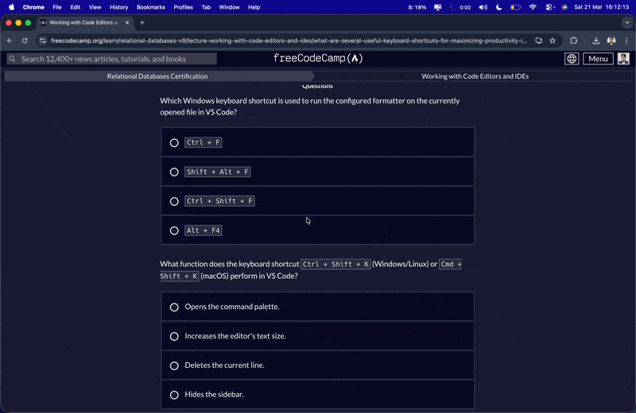
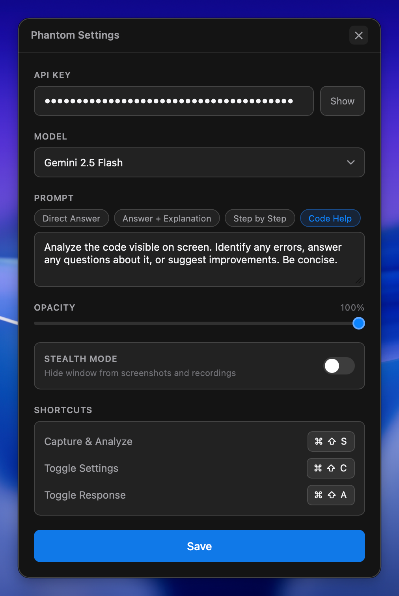
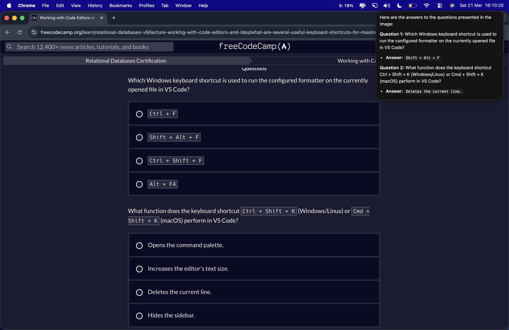

Phantom

A stealthy, AI-powered screenshot analysis tool for macOS. Capture your screen with a shortcut, get instant AI responses powered by Google Gemini — all in a floating overlay invisible to screen capture.



## Features

- **Instant Screenshot Analysis** — Press `⌘ ⇧ S` to capture and analyze your screen with AI
- **Stealth Mode** — The app window is invisible to screenshots and screen recordings
- **Multiple AI Models** — Choose between Gemini 2.0 Flash, 2.5 Flash, 2.5 Pro, and 3.1 Pro
- **Quick Actions** — Predefined prompts for common tasks (direct answer, step-by-step, code help)
- **Custom Prompts** — Write your own prompt for specific use cases
- **Adjustable Opacity** — Control window transparency from 10% to 100%
- **Always on Top** — Floating overlay that stays above all windows
- **No Dock Icon** — Runs silently as a macOS accessory app

## Screenshots

### Config Panel

The settings panel where you configure your API key, choose the AI model, set opacity, and select quick actions.



### Response Panel

The floating response window that appears in the top-right corner with the AI analysis.



## Keyboard Shortcuts

| Shortcut | Action |
|----------|--------|
| `⌘ ⇧ S` | Capture & Analyze screenshot |
| `⌘ ⇧ C` | Toggle Config panel |
| `⌘ ⇧ A` | Toggle Response panel |

## Tech Stack

| Layer | Technology |
|-------|-----------|
| Frontend | React 19, TypeScript, Vite |
| Backend | Rust, Tauri 2 |
| AI | Google Gemini API |
| Styling | CSS Custom Properties, SF Pro |
| Platform | macOS (native APIs via cocoa/objc) |

## Prerequisites

- [Node.js](https://nodejs.org/) (v18+)
- [Rust](https://www.rust-lang.org/tools/install)
- [Tauri CLI](https://tauri.app/start/)
- A [Google Gemini API Key](https://aistudio.google.com/apikey)
- macOS (required for stealth and capture features)

## Getting Started

### 1. Clone the repository

```bash
git clone https://github.com/Enzo3322/phantom-ai.git
cd phantom
```

### 2. Install dependencies

```bash
npm install
```

### 3. Run in development mode

```bash
npm run tauri dev
```

### 4. Build for production

```bash
npm run tauri build
```

The built `.dmg` will be in `src-tauri/target/release/bundle/dmg/`.

## Usage

1. Launch Phantom — it runs silently with no dock icon
2. Press `⌘ ⇧ C` to open the config panel
3. Enter your Gemini API key
4. Select a model and quick action (or write a custom prompt)
5. Press `⌘ ⇧ S` to capture and analyze your screen
6. The AI response appears in a floating panel at the top-right corner
7. Press `⌘ ⇧ A` to show/hide the response panel

## How It Works

```
┌──────────────┐     ⌘⇧S       ┌──────────────┐     base64    ┌──────────────┐
│              │  ──────────▶  │  Screenshot  │  ──────────▶  │  Gemini API  │
│    macOS     │               │   Capture    │               │              │
│              │  ◀──────────  │  (stealth)   │  ◀──────────  │   Response   │
└──────────────┘   overlay     └──────────────┘    markdown   └──────────────┘
```

1. **Capture** — Uses macOS native `screencapture` to take a screenshot (the app window is excluded via `setSharingType: 0`)
2. **Encode** — The screenshot is base64-encoded in Rust
3. **Analyze** — Sent to Google Gemini with the selected prompt
4. **Display** — The markdown response renders in a floating, always-on-top panel

## Project Structure

```
phantom/
├── src/                        # React frontend
│   ├── components/
│   │   ├── ConfigPanel/        # Settings UI (API key, model, prompts)
│   │   ├── ResponsePanel/      # AI response display
│   │   └── shared/             # Reusable components
│   ├── hooks/
│   │   ├── useConfig.ts        # Configuration management
│   │   └── useGemini.ts        # AI response state
│   ├── styles/                 # CSS variables & global styles
│   └── App.tsx                 # Main app with window routing
├── src-tauri/                  # Rust backend
│   └── src/
│       ├── lib.rs              # Tauri setup & global shortcuts
│       ├── capture.rs          # macOS screenshot capture
│       ├── gemini.rs           # Gemini API client
│       ├── commands.rs         # Tauri IPC commands
│       ├── state.rs            # Centralized app state
│       └── stealth.rs          # macOS stealth window features
└── package.json
```

## Supported Models

| Model | Best For |
|-------|---------|
| Gemini 2.0 Flash | Fast responses, general use |
| Gemini 2.5 Flash | Balanced speed and quality |
| Gemini 2.5 Pro | Complex analysis, detailed responses |
| Gemini 3.1 Pro | Latest capabilities |

## Quick Action Modes

| Mode | Description |
|------|------------|
| **Direct Answer** | Minimal, straight-to-the-point response |
| **Answer + Explanation** | Answer with context and reasoning |
| **Step by Step** | Detailed walkthrough of the solution |
| **Code Help** | Code-focused analysis and debugging |
| **Custom** | Your own prompt for specific needs |

## Permissions

Phantom requires the following macOS permissions:

- **Screen Recording** — Required to capture screenshots. macOS will prompt you on first use.

## License

MIT

---

Built with [Tauri](https://tauri.app/) and [Google Gemini](https://ai.google.dev/)
